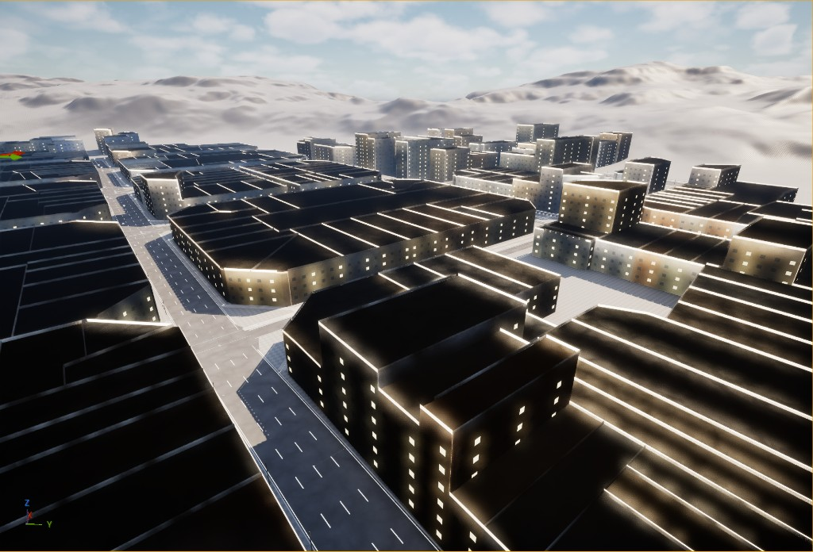
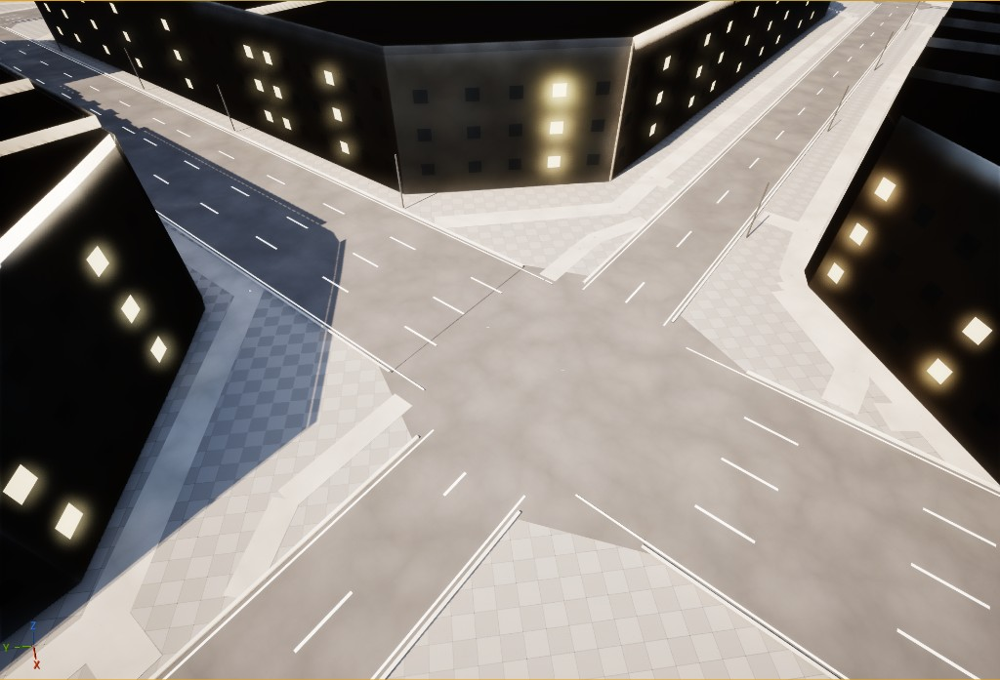
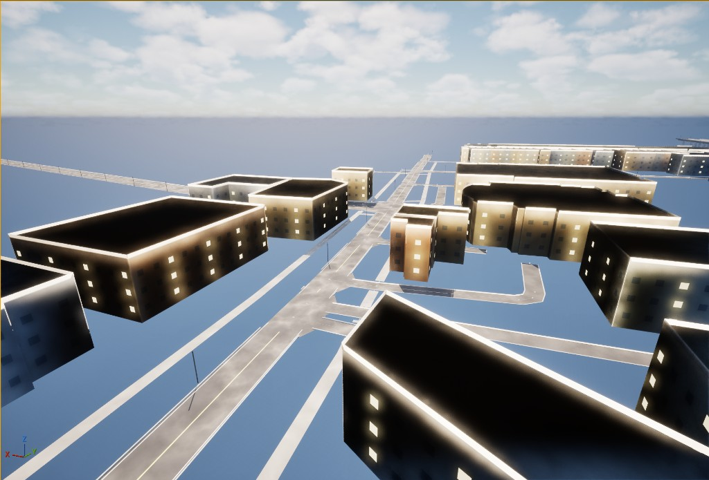

# RoadForge

**基于 OSM 的 UE5 程序化城市道路生成器** · **OSM-Based Procedural City Road Generator**

[English](README.md) | 简体中文

RoadForge 是一个基于 C++ 的虚幻引擎项目，用 OpenStreetMap 数据生成城市道路场景。它把 OSM 路网转换成样条，再程序化生成路面网格，并加上车道线、路缘石、人行道、高架桥面、简单建筑和实例化路灯。

项目面向 Unreal Engine 5.7，采用运行时 C++ 网格生成，而不是预制的道路资产库。

> 如果 RoadForge 对你有帮助，欢迎点个 Star，这能让更多人发现它，谢谢！
>
> 如果你有任何优化想法，欢迎联系我：yuuhen@outlook.com

## 示例截图

基于 OSM 数据生成的街区和路网：



带车道线、路缘石和人行道的路口：



地面路网之上的高架道路和桥面：



## 功能

- 从 Overpass API 获取道路与建筑数据，也可以用本地 OSM JSON 文件生成。
- 把 WGS84 经纬度坐标投影到虚幻引擎的本地厘米坐标。
- 生成路面、人行道、路缘石、车道线、边线、高架桥面、路口补丁、建筑、立面细节和路灯实例。
- 支持 `highway`、`lanes`、`lanes:forward`、`lanes:backward`、`oneway`、`layer`、`bridge`、`tunnel`、`building`、`height`、`building:levels` 等 OSM 标签。
- 通过 RoadForge 工具菜单生成编辑器材质和辅助光照。
- 可选生成样条组件，方便在关卡里查看或手动编辑已生成的道路。

## 环境要求

- Unreal Engine 5.7
- 可编译虚幻 C++ 项目的 Windows 开发环境
- 需要启用的引擎插件：
  - ProceduralMeshComponent
  - PCG
  - ModelingToolsEditorMode（仅编辑器）

## 快速开始

克隆仓库，用 Unreal Engine 5.7 打开 `ForPCG1.uproject`。如果引擎提示重新编译模块，允许即可。

如果想用命令行编译，在 Developer Command Prompt 或 PowerShell 里把 `UE_ROOT` 设为你的引擎安装目录，然后运行：

```powershell
& "$env:UE_ROOT\Engine\Build\BatchFiles\Build.bat" ForPCG1Editor Win64 Development -Project="$PWD\ForPCG1.uproject" -WaitMutex
```

示例：

```powershell
$env:UE_ROOT = "E:\UE\UE_5.7"
& "$env:UE_ROOT\Engine\Build\BatchFiles\Build.bat" ForPCG1Editor Win64 Development -Project="$PWD\ForPCG1.uproject" -WaitMutex
```

## 基本用法

1. 在虚幻编辑器里打开项目。
2. 使用 `Tools -> RoadForge -> Add OSM Road Generator to Level`。
3. 选中生成出来的 `OSMRoadGenerator` actor。
4. 在 Details 面板里设置一个 WGS84 包围盒，或者填入本地 Overpass JSON 文件路径。
5. 点击 `Fetch And Generate` 或 `Generate From Local File`。

使用公共 Overpass 服务器时，范围不要太大。一到两个街区大小的包围盒是比较合适的起点。范围太大容易触发限流，也会生成非常重的程序化网格。

## 工具菜单

四个功能都在虚幻编辑器的 `Tools -> RoadForge` 菜单下。

- **Add OSM Road Generator to Level（添加 OSM 道路生成器到关卡）** —— 在世界原点生成一个 `OSMRoadGenerator`，用内置的示例数据生成路网，并加入一套电影级光照。最快看到效果的一键入口。
- **Import OSM File (New Generator)...（导入 OSM 文件并新建生成器）** —— 新建一个生成器，弹出文件选择框，让你选择任意 OSM 或 Overpass JSON 导出文件，生成对应地图并加上光照。换一座城市最快的方式。
- **Add Cinematic Lighting Rig（添加电影级光照）** —— 创建或重新调校光照：定向太阳光、天空光、SkyAtmosphere、体积云、体积高度雾，以及一个无边界的后期处理体积，让场景接近参考项目的观感。
- **Regenerate RoadForge Material（重新生成 RoadForge 材质）** —— 重建共享 PBR 材质 `/RoadForge/M_RoadForge_VC`，如果已导入 CC0 细节贴图，会自动连接好。

## OSM 数据

仓库默认不包含下载好的 OSM 数据。要用本地数据，可以下载一份包含道路和建筑 way 及其几何信息的 Overpass JSON：

```text
[out:json][timeout:90];
(
  way["highway"](south,west,north,east);
  way["building"](south,west,north,east);
);
out geom;
```

把 `south,west,north,east` 替换成你的包围盒数值。OpenStreetMap 数据基于 Open Database License 提供，在分发数据集或衍生的地图内容时请保留相应署名。

## 仓库内容

- `ForPCG1.uproject` —— 虚幻项目描述文件。
- `Source/ForPCG1/` —— 最小化的宿主项目模块。
- `Plugins/RoadForge/` —— RoadForge 运行时与编辑器插件。
- `Config/` —— 打开并渲染场景所需的项目默认配置。

`Binaries`、`Intermediate`、`Saved` 等生成目录，以及下载的地图数据、私人笔记和参考项目都被有意排除在版本库之外。

## 已知限制

复杂的多层立交仍然是最难处理的情况。RoadForge 已经包含桥梁分层处理、高架合流补丁和匝道清理，但不同城市的 OSM 拓扑差异很大，密集的高架路段可能仍需要本地调参或手动整理样条。

生成的建筑是简单的程序化拉伸体，定位是体量占位，而不是可直接用于成品的建筑模型。

## 许可证

RoadForge 基于 MIT 许可证发布，详见 `LICENSE`。
